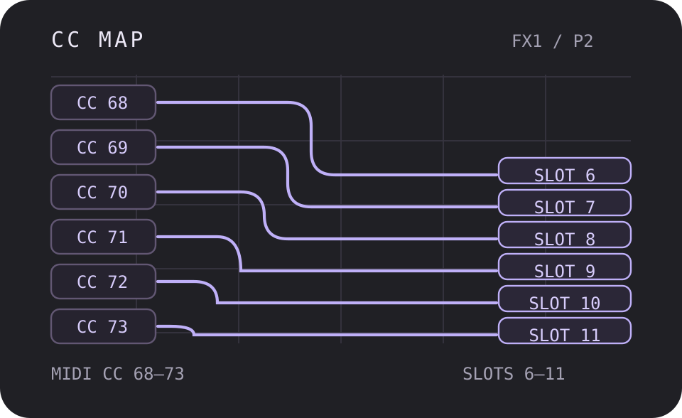
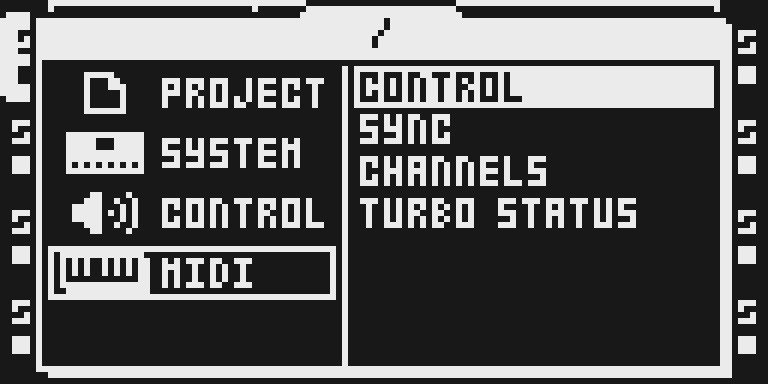
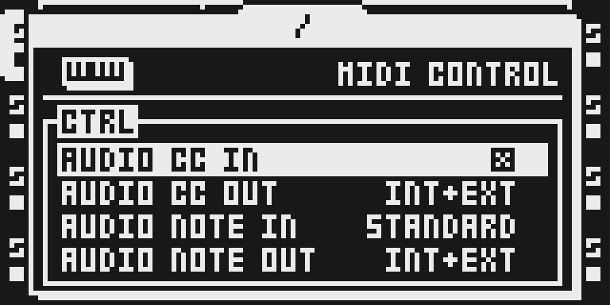

# CC Map

Version: `0.1.1-experimental` · author: Sam Banks (@sambanks).

Original Octamod thumbnail illustration, MIT. Actual LCD captures appear below.

Requested on 2 October 2026. **Source draft only.** Publication and firmware
builds require full qualification, integration and owner review. Real emulator
LCD captures and a short practical tutorial are included; UI evidence does
not establish hardware safety.
This folder is outside `sdk/octabam/modules/`: native discovery, the public
catalog and source-package compilation cannot pick it up. The eleven-module
qualification baseline is unchanged.

## Overview

CC Map receives MIDI CC messages on audio tracks' assigned channels and maps
CC 68–73 to FX1 page-2 slots 6–11. The upstream CC 62–67 block targets FX2
page-2 slots 6–11 **only for BusDelay and BusVerb**. Those two engines are
outside Octamod's scope and are not imported here. Do not advertise that block
as support for stock FX2, Mini Verb, Tape Echo or another catalog effect.

The handler respects AUDIO CC IN, writes every audio track matching the
channel, clamps values using the relevant counts and sets Part dirty flags.
CCs outside 62–73 pass to the next handler. CCs inside that range are consumed
even when AUDIO CC IN is disabled or the track has no eligible effect.

## Controls

| Incoming CC | Target | Eligible effect |
|---|---|---|
| 62–67 | FX2 page-2 slots 6–11, respectively | BusDelay / BusVerb only; outside scope |
| 68–73 | FX1 page-2 slots 6–11, respectively | Non-NONE FX1; descriptor min/count clamps |

There is no added effect chooser row or independent set of knobs. Meanings
and ranges depend on the selected effect. FILTER's captured second page has
HP, LP, ENV, HOLD, Q and DIST, in that CC order. The UI example below changes
HP from 12 dB to 24 dB with CC 68 value 1. It does not qualify all effect
types, parameter limits or hardware behavior. Sustain and other pedals may
send CC 64–67 without an explicit controller assignment.

## Usage

The following MKII panel steps were checked against the actual emulator LCD
from the isolated CC Map build. MKI access and real-hardware behavior remain
unverified. The automatic USB no-UI exception does not apply.

1. Press PROJ. Select MIDI with UP/DOWN, press RIGHT to enter its list, select
   CONTROL and press YES.
2. Select AUDIO CC IN and turn LEVEL until its checkbox is enabled.
3. Press NO to return to the MIDI menu, select CHANNELS and press YES.
   Match the controller to the target track's TRIG CH. The captured fresh
   project assigns T1 to channel 1; AUTO CH 11 is a different setting.
4. Press NO twice to return to the track. Press T1, then hold FUNC and press
   FX1 for FX1 SETUP. Turn LEVEL to FILTER and press YES to assign it.
5. FILTER's SETUP shows the second-page controls. Press FX1 to return to its
   main page; FUNC+FX1 opens SETUP again.

### Try an FX1 page-2 parameter after qualification

1. Enable AUDIO CC IN in PROJ > MIDI > CONTROL. In MIDI > CHANNELS, set T1's
   TRIG CH to 1 and send from the controller on channel 1.
2. Select T1 and FILTER in FUNC+FX1 SETUP. Note the HP setting of 12 dB, then
   send MIDI CC 68 value 1 on channel 1 to address the first page-2 slot.
3. Close SETUP with FX1 and reopen it with FUNC+FX1 to refresh the displayed
   value: HP reads 24 dB. CC 68 value 0 selects 12 dB. Qualify audio response,
   unrelated tracks and Part save/reload separately before hardware use.

The capture used the emulator's real UART0 MIDI input (`b0 44 01`), not a
parameter poke or relabelled image. The cave omits the stock editor's redraw
call, hence the page refresh in step 3. Do not use this draft as a flashable
build. Further development uses isolated execution and local firmware only.

## Compatibility and limitations

The native declaration targets OS 1.40C and uses a floating ColdFire cave plus
one MIDI dispatch-vector replacement. It has no DSP algorithm or effect ID.
All Octamod combinations, hook placement and browser packaging are unverified.

The default `CC_NEXT` is stock's CC handler; `CC_MODEDEF1/2` default to a stock
return instruction. Upstream can override these for its SCENES KITS bridge
and MODE DEFAULTS. Neither module is imported or enabled here. OctaKit,
MIDI Scenes, USB MIDI and Scale Quantizer interoperability needs separate
review; upstream remix results do not prove Octamod compatibility.

Upstream leaves FX2 support outside BusDelay/BusVerb, hardware SCENES KITS
chaining and hardware FX1-to-DSP updates on THRU tracks open. Controllers'
standard pedal messages overlap the claimed CC range. Exercise those cases
and channel-sharing behavior in the eventual qualification project.

## Tests and measurements

See [TESTING.md](TESTING.md). Source integrity and metadata checks do not run
the imported manifest, assembly, firmware, DSP, emulator or hardware tests.
Upstream's historical MKII notes and emulator gates are retained in
[OCTABAM.md](OCTABAM.md); they do not qualify this Octamod version.

The isolated capture build linked 724 bytes, matching the authored 712-byte
code oracle plus twelve table bytes. That cave size is not a complete memory
total: placement, padding, stack peaks, shared firmware state and maximum
workload need actual reports. Worst-case cycles and budgets are unmeasured.

## Authorship and licences

[Sam Banks' octabam source](https://github.com/sambanks/octabam/tree/8d0ad6f4f82c2efbc10e1c65eefbce0ad1cec4bf/modules/cc-map)
is pinned to `8d0ad6f4f82c2efbc10e1c65eefbce0ad1cec4bf` under the full
[MIT licence](LICENSE). The assembly and upstream notes are unchanged.
The manifest has one documented adaptation: its stock dispatch expectation
uses a lazy address/length/hash guard, resolved from locally verified 1.40C.
The authored hand-assembled cave oracle is original module code, not a copied
stock routine. [Import identities](../../imports/cc-map-8d0ad6f.json) retain
both upstream and vendored hashes and the exact transformation.

Only source, documentation, licences, the original illustration and reviewed
LCD captures/metadata are included. No firmware, extracted routines/tables,
generated native output or upstream media is imported.
The import preserves the upstream MIT notice; contributor declaration and
owner/reviewer verification of source rights and reports remain required
before publication. Review is not automatic legal clearance.

## Screens and audio

Actual 128×64 LCD pixels from the isolated CC Map build, MKII panel, transport
stopped and a fresh empty scratch card. Integer scale 6; only the renderer's
on/off palette is changed to monochrome. No labels or control pixels are
reconstructed. [Capture metadata](media/capture.json) binds source/version,
local image/emulator hashes, plans and file hashes; [media rights](media/LICENSE.md)
preserve underlying Elektron rights. No audio preview is supplied.

These pages document the actual enable/routing settings and one mapped
control example. They do not prove every effect, audio continuity, Part
persistence or real-hardware behavior. Firmware, raw LCD/RAM dumps,
temporary cards, generated images and private logs are removed after capture.

Promotion to `sdk/octabam/modules/cc-map/` needs a complete
`tests.qualification`, owner verification of UI/documentation, reviewed integration
and an owner-merged PR. Do not add this draft to the frozen baseline.
Every subsequent source, documentation or media update needs a higher module
semantic version. Real browser/native byte parity and rejection evidence are
additional requirements before firmware builds can include it.
