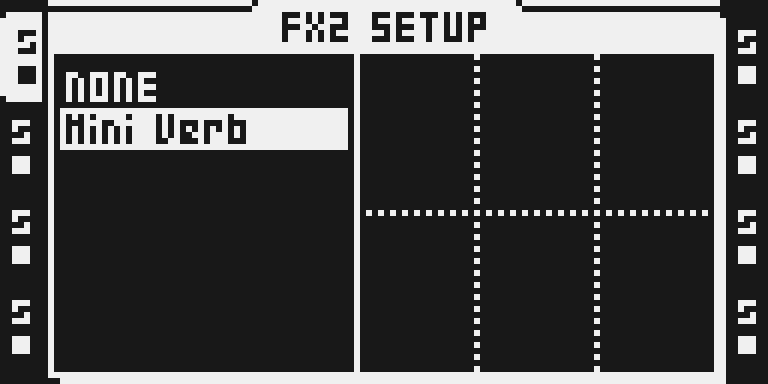
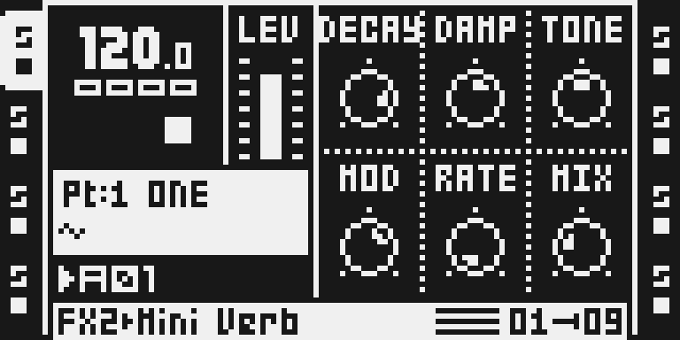

# Mini Verb — Tone and lower-right Mix draft

Version: 0.2.0-experimental · author: [Jannik Aßfalg](https://github.com/repeat98)

## Overview

This draft keeps Mini Verb's accepted four-branch, eight-allpass feedback tank
and adds a small stereo tone stage on the wet output. It moves Mix down one
row into the empty encoder F slot and puts Tone above it on encoder C.
The draft manifest pins the exact implementation and DSP-evidence commit.
This folder updates the published voice; it is not an unchanged source import.
The published 0.1.2-experimental module remains available while this draft
awaits current-image release qualification. Staged version-matched notes are
in [release-notes.json](release-notes.json); promotion must copy that entry to
`src/community/module-changelogs.json` together with the catalog version pin. Do not import this folder as a
second module: it updates the existing `miniverb` identity and FX ID 0x17.

## Controls

The main FX2 page is:

| Encoder | Upper row | Default | Encoder | Lower row | Default |
| --- | --- | ---: | --- | --- | ---: |
| A | DECAY | 104 | D | MOD | 80 |
| B | DAMP | 70 | E | RATE | 2 |
| C | TONE | 64 | F | MIX | 40 |

- DECAY sets tank feedback from 0.65 to below 0.968; room geometry is fixed.
- DAMP darkens the recirculating tail as it decays. Its existing behavior stays unchanged.
- TONE colors only the wet output: 0 is dark, 64 is exactly neutral, 127 is bright.
- MOD controls the smoothed depth of two interpolated in-loop allpasses, up to about 64 samples.
- RATE selects eight existing modulation speeds, approximately 0.34–2.69 Hz.
- MIX is 0 for exact dry and 127 for fully wet, with the existing smoothing.

The setup page has no additional controls. Tone uses one first-order filter
per stereo channel and four new scalar words in the existing instance block;
no additional delay allocation, global writable state or filter inside the
feedback tank. Dark uses a 1/16-coefficient low-pass; bright subtracts the same low-pass
to produce its complementary high-pass. Their shared crossover is about
453 Hz at 44.1 kHz. Intermediate values blend toward the neutral voice
without boosting a band. Bright removes bass rather than adding treble gain.

Tone smooths per sample with a 1/256 coefficient. The crossover stays fixed during movement, and an exact neutral bypass
preserves the previous voice's audio and reduces its instruction cost.
A sub-LSB remainder snaps to its target once per process call, outside the
sample loop, so returning to 64 reaches an exact bypass. Both stereo
filter histories clear with the existing unconditional instance initialization.

## Usage

### Quick tutorial

1. In a private test build, select an audio track, hold FUNC and press FX2, then choose Mini Verb with LEVEL and YES.
2. Press FX2, turn encoder F (MIX) to 127, and compare encoder C (TONE) at 0, 64 and 127 while playing a sample.
3. Lower MIX to place the colored reverb behind the dry signal; set MIX to 0 to hear the exact dry signal and bypass the wet output.

Use DAMP to set how quickly the tail loses high frequencies, then use Tone to
place the whole wet signal in the mix. Tone does not alter the tank feedback,
room lengths, modulation clock or existing DECAY/DAMP/MOD/RATE mappings.

## Compatibility and limitations

FX2, Octatrack OS 1.40C; own effect ID 0x17 beside DARK REV. This is a source
draft and is excluded from the public catalog and packages. Install only in a
private disposable build after reviewing the remaining tests in TESTING.md.

**Existing project data needs migration.** Parameters are stored by slot, not
name. Slot C previously held MIX and now holds TONE; slot F previously had no
control and now holds MIX. Restore TONE to 64, copy the previous Mix value to F
in every affected Part, and move Mix parameter locks, scene assignments and LFO
destinations from C to F. Slot C values from an old project are not a valid Mix
setting in this draft. Back up the original project before changing it. The
FX ID stays the same, so old projects still select Mini Verb but cannot
implicitly migrate these parameter bytes. Downgrading requires the reverse
mapping and removal of Tone automation.

The four original controls retain their slots, ranges and defaults. Both new
and moved continuous controls must still be checked with parameter locks,
scenes, crossfader and LFOs on an actual unit. Physical reboot and usable audio
after Part/project reload have not been verified for this source.

## Tests and measurements

[TESTING.md](TESTING.md) distinguishes native DSP results from pending common
builder, UI, cycle/load and hardware qualification. [verify.py](verify.py)
assembles with the existing common native assembler and its disassembly audit,
then runs the existing DSP host against the developer's private stock payloads.
It does not substitute for native/browser composition parity or chip timing.

The 16K ring allocation and its occupied 13,750 positions are unchanged.
Tone adds target/current state at X:(r7+$2e/$2f) and left/right pole history at
X:(r7+$3c/$3d), within the original X:(r7+$20..$3f) block. Initialization still
clears all 32 scalar words and progressively clears the same 16K ring.
Historical 0.1.2 cost and audio measurements remain in the published module;
they are not relabeled as tests of this draft.

## Authorship and licences

Original Mini Verb by Jannik Aßfalg; octabam by Sam Banks, with component
credits in [the SDK attribution](../../octabam/THIRD_PARTY.md).
Source remains under the original [MIT licence](LICENSE). This change adds
no stock firmware, code tables or proprietary assets to the repository.

## Screens and audio

Actual firmware-rendered LCD captures from the private common-builder image:

These emulator captures show the new layout with transport stopped and an
empty scratch card; they do not prove hardware behavior or audible playback.
See [capture provenance](media/capture.json) and [capture rights](media/LICENSE.md).
The native verifier writes private dark/neutral/bright percussion WAVs for
level-preserving listening. No claim of listening acceptance or physical
hardware testing is made until an actual result is recorded.
