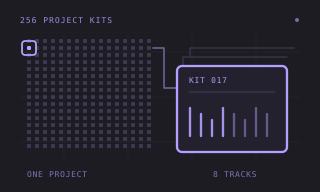
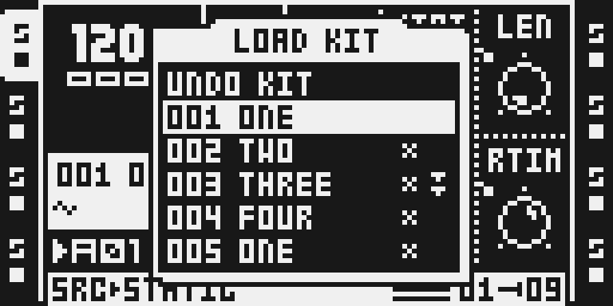
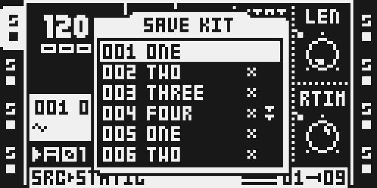
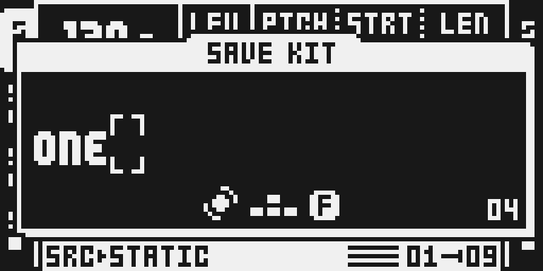

# OctaKit

Version: `0.1.1-experimental` · author: June Kiff (@emuyia).

**Draft: unavailable in the configurator until qualification, packaging and
owner review are complete.** Source, documentation and original thumbnail are
staged outside native discovery. Follow [the standard agent workflow](../../../docs/MODULE_ADDITION_WORKFLOW.md)
for further work; complete each available step rather than handing it back to
the owner.

## Overview

OctaKit replaces the Octatrack's 64 bank-tied Parts with **256 project-wide
Kits**. A Kit holds the sound/control settings normally associated with a
Part; patterns can use Kits independently of their bank. LOAD KIT, SAVE KIT,
reload, seven-character names and Kit slot clipboard operations make it useful
for recalling a shared sound setup or keeping variations of a pattern and its
Kit together. There is no new DSP algorithm or effect chooser entry.

Old projects migrate their Parts into the first 64 Kit slots with pattern
assignments retained. **Back up the project before opening it in an OctaKit
build. Returning to stock may lose Kit data.** Upstream reports a 3.6% Flex
pool reduction: 18.4 seconds at 16-bit or 12.3 seconds at 24-bit. This is the
pinned author's description, not a new hardware measurement.

## Controls

| Action | MKII | MKI | Result |
| --- | --- | --- | --- |
| Load | PART | FUNC+MIDI | Open LOAD KIT; select with UP/DOWN or LEVEL and confirm with YES. |
| Save | FUNC+PART | FUNC+BANK | Open SAVE KIT; choose the destination, confirm and name the Kit. |
| Reload | FUNC+CUE | FUNC+CUE | Restore the assigned Kit's saved state. |
| Quick save | FUNC+PART+YES | FUNC+BANK+YES | Skip the name prompt when saving. |
| Undo loaded Kit | LOAD KIT > UNDO KIT | LOAD KIT > UNDO KIT | Recall the last loaded Kit. |
| Copy / paste / clear | FUNC+REC / FUNC+STOP / FUNC+PLAY in a Kit menu | Same | Manage the selected Kit slot; repeat the corresponding operation to undo where offered. |
| Pattern and Kit paste | FUNC+STOP+PART when pasting a pattern | FUNC+STOP+MIDI | Save the assigned Kit to the next available slot with the pattern. |
| New pattern variation | PTN+FUNC+RIGHT | Same | Save the current Kit, copy Kit/pattern to the next available slots, then load the pair. |
| Inactive pattern clipboard | PTN+FUNC+TRIG | Same | Copy/paste/clear/undo an inactive pattern; BANK+TRIG, then BANK+FUNC+TRIG reaches another bank. |

Names contain up to seven characters. Use the stock name editor's cursor and
character controls and YES to confirm; NO cancels. Unassigned Kit slots carry
an asterisk. Audio/MIDI parameter pages remain the normal track controls;
OctaKit has no additional numeric DSP knobs, ranges or defaults. Clipboard
behavior and pattern shortcuts are documented from the pinned author's README;
a UI capture alone does not prove persistence or undo correctness.

## Usage

Work on a backed-up project copy. Open LOAD KIT to choose a shared sound setup,
edit the track parameters, and use SAVE KIT to store a variation. Reusing a
Kit across banks allows patterns to share the same setup. Saving to another
slot separates the variation from the original. Reload discards subsequent
unsaved edits; UNDO KIT recalls the last loaded Kit.

The table above gives both panel entry points. Capture provenance and the
exact tested sequence are in [TESTING.md](TESTING.md). Panel support and
composition with the other Octamod modules still need qualification.

## Quick tutorial: save and recall a Kit

1. Back up the project and open a disposable copy in an OctaKit build; old Parts migrate to the first 64 Kit slots.
2. On MKII, press PART to open LOAD KIT; on MKI, hold FUNC and press MIDI. Select a Kit with UP/DOWN or LEVEL and press YES.
3. Edit an audio track parameter, then open SAVE KIT with FUNC+PART on MKII or FUNC+BANK on MKI. Choose the destination and press YES; enter a name of up to seven characters and confirm.
4. Hold FUNC and press CUE to reload the saved Kit and discard subsequent unsaved edits. Use LOAD KIT > UNDO KIT to return to the last loaded Kit.

## Compatibility and limitations

Base firmware: original OS 1.40C, supplied and verified locally. The pinned
source describes MKI and MKII access. This draft does not enable firmware
builds or qualify either model for performance/hardware use.

- Backups are essential: Parts migrate to Kits and downgrading may lose data.
- The shared audio arena reserves 528 pages (3,244,032 bytes), shrinking Flex
  capacity. Full peak memory/stack/accounting remains unmeasured.
- MIDI Scenes, Scale Quantizer and other Octamod combinations are unverified.
  Hook ownership, runtime caller checks, arena placement and any bridges need
  reviewed integration; do not infer compatibility from upstream remix names.
- Upstream leaves dirty marking, UNDO KIT and pattern paste after external
  parameter writes open. Capture evidence does not resolve those questions.
- Runtime code contains instructions recovered from the local base. It cannot
  be distributed as a stock-free package without adapted local reconstruction.

## Tests and measurements

[TESTING.md](TESTING.md) separates file identity checks, isolated UI-build/capture
evidence and the remaining qualification work. The upstream manifest's
`Proof.HARDWARE` refers to historical use, not this version. Worst-case
ColdFire cycles, complete memory regions/totals and a passed 60-minute real
hardware stress project with eight active audio tracks are still required.
Do not claim those measurements from compilation or UI screenshots.

The [qualification template](qualification.example.json) records the practical
tutorial while keeping unavailable measurements pending. It is deliberately
incomplete and is not assigned to `tests.qualification`. Publication checks
must keep rejecting the draft until actual reports and owner verification are
complete. Browser/native parity, rejection and stock-free packaging are also
pending. The frozen eleven-module baseline remains unchanged.

## Authorship and licences

- June Kiff (@emuyia): [Em's Octakit](https://github.com/emuyia/ems-octakit/tree/c6d3f3927b13fda0cf03711157237b837acdb1f9), MIT, recipe `ot-26914-152100`.
- Sam Banks (@sambanks): [octabam integration](https://github.com/sambanks/octabam/tree/8d0ad6f4f82c2efbc10e1c65eefbce0ad1cec4bf/modules/octakit), MIT.
- [Integration licence](LICENSE), [author licence](upstream/LICENSE),
  [original integration notes](OCTABAM.md) and [author instructions](upstream/README.md)
  remain intact. [Import identities](../../imports/octakit-8d0ad6f.json) pin all
  upstream files, hashes and Git blobs; the runtime/manifest were not edited.
- Original SVG thumbnail and Octamod documentation: Octamod contributors, MIT.
  Its 256-slot diagram is an illustration, not LCD evidence. Actual LCD
  screenshots retain the rights/declaration in [media/LICENSE.md](media/LICENSE.md).
  Owner/reviewer verification is required; review is not automatic legal clearance.

Only sparse authored writes, hashes and local-copy/relocation recipes are
imported. `.incbin "stock/NNNN.bin"` inputs are derived from the developer's
verified local 1.40C. Never commit generated routines/runtime blobs, firmware,
images, raw LCD/RAM dumps or private cards, or give firmware to automation.

## Screens and audio

The following images are actual monochrome emulator LCD captures, with source,
local-build and setup provenance in [media/capture.json](media/capture.json).
They document access and controls, not real-hardware stress results. Audio is
optional and no recording is included.

Press PART on MKII to open LOAD KIT. The list also exposes UNDO KIT and marks
unassigned slots with an asterisk.

Hold FUNC and press PART to open SAVE KIT and choose the destination.

Press YES on a SAVE KIT slot to open its seven-character name editor.

These captures verify the MKII menu entry and name-editor sequence. The MKI,
clipboard, reload/undo and pattern-copy instructions above retain the author's
description and still require current behavioral/hardware qualification.
