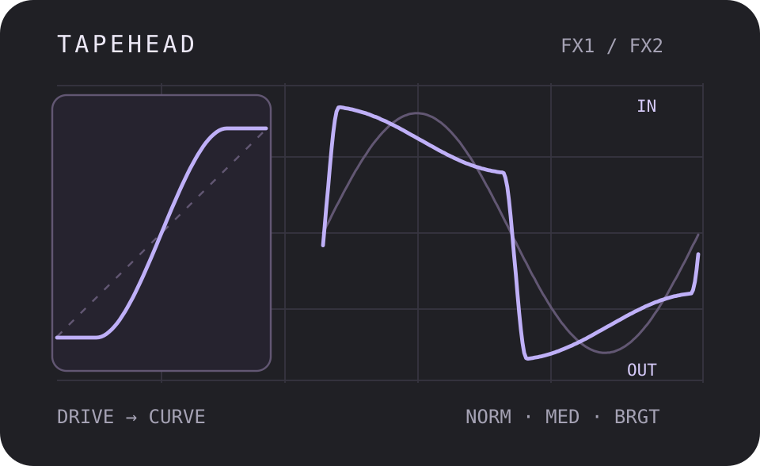
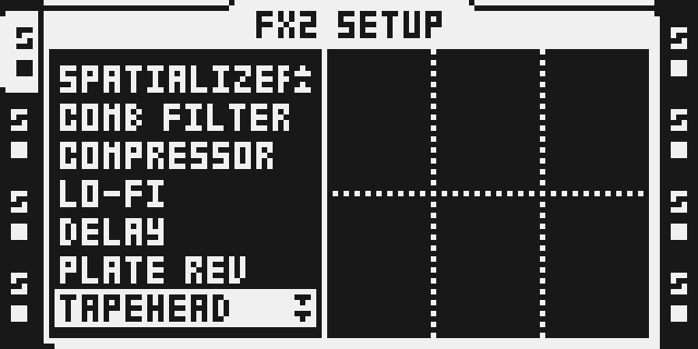
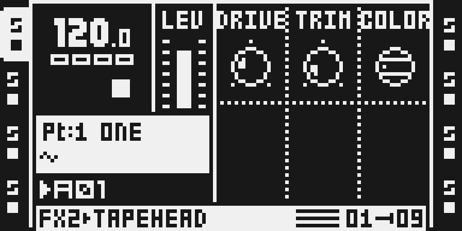
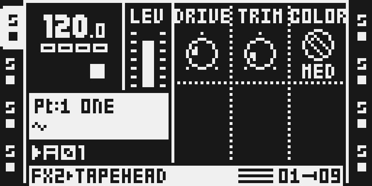

# TapeHead

Version: 0.1.0-experimental · author: @devilfish707 · algorithm: JClones (MIT)

**Source draft.** It is outside native discovery, the catalog and the
firmware builder until hardware qualification and owner review are done
(see [Tests and measurements](#tests-and-measurements)).

## Overview

TapeHead is a DSP56300 port of `JClones_TapeHead.jsfx`, a small tape-style
saturator. The input drives a two-state coupled recursion whose corner
frequency COLOR sets. Both states go through a cubic smoothstep curve
(`1.5v - 0.5v³`, flat beyond ±1) at the DRIVE gain. A clipped copy of the
recursion's third term is added at a fixed negative gain, and TRIM sets the
output level. The output store limits at full scale, as the JSFX does with
its Clip switch on.

At low DRIVE it rounds peaks gently and tilts the tone slightly. At high
DRIVE it flattens peaks, thickens the low end and adds edge on transients.
It suits drum buses, bass and anything that sounds too clean.

It is a buffer-free insert: no allocator memory, no bus role and no absolute
Y addresses, so it runs on FX1 or FX2 of any track.

The module was written and heard on hardware in octabam (12 Sep 2026). The
first native render against the float JSFX, made for this port, found three
defects in that build. This version fixes them, so **it sounds different from
the octabam build**. Details are under [Tests and measurements](#tests-and-measurements).

## Controls

All three controls are on the FX main page. The SETUP page has no TapeHead
controls.

| slot | control | default | range | what it does |
|---|---|---|---|---|
| 0 | DRIVE | 36 | 0–127 | Drive into the smoothstep curves. 0–127 maps to the JSFX drive 1–10, a gain of 0.8× to 8×. 36 is about the JSFX default 3.5. |
| 1 | TRIM | 18 | 0–127 | Output trim. 0 is 0 dB, 127 is −21 dB, linear in dB. 18 is the JSFX default −3 dB. Higher values are quieter. |
| 2 | COLOR | NORM | NORM / MED / BRGT | Corner of the recursion: 2100, 3680 or 5000 Hz. Higher corners let more top end into the saturator. |

DRIVE and TRIM are continuous where the JSFX has 10 and 22 integer steps.
The ranges and formulas are the JSFX's; each knob is a degree-5 polynomial
fit of the formula, within 4.7e-4 of it over the whole knob.

The JSFX Clip switch is not exposed: Clip is always on, which is the JSFX
default. Q1.23 cannot carry the unclipped mode's values above 1.

## Usage

1. Select an audio track that plays a sample.
2. Hold FUNC and press FX2 (or FX1) to open its SETUP. Turn LEVEL to
   TAPEHEAD and press YES.
3. Press FX2 (or FX1) for the main page.

A useful start on drums: DRIVE 70, TRIM 30, COLOR NORM. Raise DRIVE until the
transients round off, then use TRIM to match the level with the effect
bypassed.

## Quick tutorial: saturate a drum loop

1. **Set up.** On a track playing a drum loop, hold FUNC and press FX2, turn LEVEL to TAPEHEAD and press YES. Press FX2 to see DRIVE 36, TRIM 18 and COLOR NORM.
2. **Drive it.** Turn DRIVE to 100: the peaks flatten and the kick thickens. Turn TRIM to about 40 to bring the level down. Switch COLOR to BRGT for more top end, NORM for a darker tone.
3. **Compare.** Choose NONE in FX2 SETUP to compare with the dry track. Re-selecting TAPEHEAD clears its internal state.

## Compatibility and limitations

- Location: FX1 or FX2, any of the eight tracks. Effect ID 0x1f, which is
  not a stock ID and no Octamod module claims. Build priority 17 (after
  Euclid's 16) and harness letter `4`. The ledger check found no clash with
  the eleven Octamod modules; `make modules` stays the arbiter.
- OS 1.40C only, as for every Octamod module. MKI and MKII use the same DSP
  code; the MKII panel has been captured in the emulator only.
- 44.1 kHz is assumed for the COLOR corners.
- The cost is 288 cycles/sample per instance by the static counter,
  whatever the settings. Eight instances on one core (FX1 and FX2 on four
  tracks) price at 2,304 of the 3,120 cycles/core modules may use, leaving
  816 for everything else on that core. Selections that also carry
  heavy modules on the same tracks may not fit; the build's cycle check
  decides.
- Projects saved with the octabam build keep working: the ID (0x1f) and the
  slot layout (DRIVE, TRIM, COLOR on slots 0–2, COLOR a 3-way select) are
  unchanged.
- The octabam build heard on 12 Sep 2026 had different arithmetic (see below).
  If you liked that sound, it is not this one.

## Tests and measurements

See [TESTING.md](TESTING.md) for commands and numbers. In short:

- **Against the JSFX (emulator):** `verify.py` assembles `tapehead.asm`,
  runs it in `dsp_host` and compares it with `reference.py`. Peak error is
  4.7e-4 over COLOR × DRIVE {0, 36, 127} × TRIM {0, 18, 127} × six
  signals. Silence in gives silence out, COLOR 1 renders MEDIUM, the stereo
  channels are independent, the sample routines are straight-line and no
  `mpysu` remains. In the composed test image it renders within 3.9e-5 of
  the JSFX at the defaults.
- **Against SPRING REV (emulator, `benchmark.py`):**

  | | TapeHead | Spring Reverb |
  |---|---:|---:|
  | one instance, instructions per sample | 268 | 262 |
  | four per core, worst peak per 16-sample block | 17,616 | 20,376 |
  | DSP program | 416 words | 1,063 words |
  | FX2 instance buffer | none | 16,384 words |
  | state | 31 words of its r7 block | — |

- **Fixed in this port**, each found by the first render (the octabam build
  measured a peak error of 1.6):
  1. The branchless MIN stages returned 2 × min. Smoothstep ran at twice the
     drive and evaluated past ±1, where the cubic folds back, and the clipped
     y3 term was doubled.
  2. The `|g3| · y3` term reaches 1.16 and was stored at full scale, which
     limits it at 0.99999. The half is now stored.
  3. Page-1 values arrive as value << 16, but COLOR was compared with 1, so
     MED selected BRGT.
- **Composed build:** `tapehead-spring` builds, packs into
  `OCTATRACK_OCTABAM2.bin` with a valid checksum, boots in the emulator and
  draws the chooser and page above. `verify_menu`, `verify_initregs`,
  `verify_replaces --image` and `label_fmt` pass.
- **On hardware:** the author flashed the OCTABAM2 test image on 2 Oct 2026
  and reported it works well (a listening test, not a stress run).
- **Not done:** the 60-minute eight-track hardware stress project
  and worst-case cycles measured on hardware.

## Authorship and licences

- TapeHead port, manifest, gate, reference model and documentation:
  @devilfish707, MIT ([LICENSE](LICENSE)).
- Algorithm: `JClones_TapeHead.jsfx`, Copyright (c) 2026 JClones, MIT. The
  full notice is in [LICENSE](LICENSE) and
  [`../../octabam/licenses/jsfxclones.txt`](../../octabam/licenses/jsfxclones.txt).
- Built and verified with the octabam SDK, Copyright (c) 2026 Sam Banks, MIT.
- The thumbnail is original, drawn from `reference.py`'s output. It is an
  illustration, not an Octatrack screenshot.
- No Elektron firmware, extracted routines or tables are included.

## Screens and audio

Captured from the MKII panel of the Octamod emulator running the hardware
test image (`hardware-test-remix.py`): real LCD pixels, not a
reconstruction. No audio is included.

## Files

| file | what it is |
|---|---|
| `tapehead.asm` | the DSP56300 source |
| `manifest.py` | the native declaration: ID, menu, controls, gate |
| `verify.py` | the render gate (standalone `dsp_host`, no firmware) |
| `reference.py` | the float JSFX and the knob mapping |
| `gen_constants.py` | prints every hex constant in `tapehead.asm` |
| `benchmark.py` | instruction counts against stock SPRING REV (needs your local 1.40C) |
| `hardware-test-remix.py` | the remix the OCTABAM2 test image was built from |
| `media/` | emulator LCD captures and their provenance |
| `octamod.module.json` | website metadata |
| `qualification.example.json` | the qualification record, incomplete |
| `presentation/thumbnail.svg` | the card illustration |
