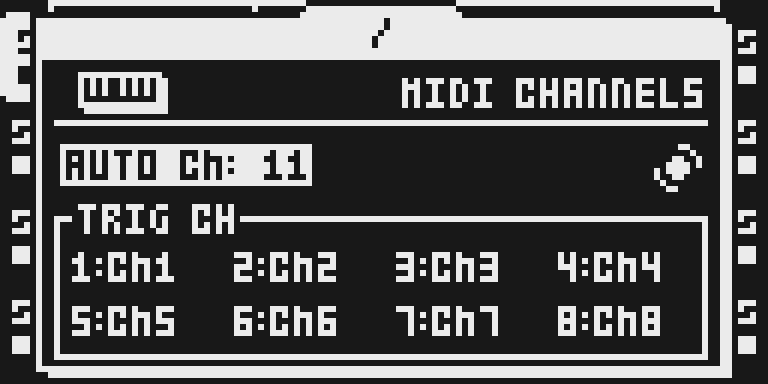
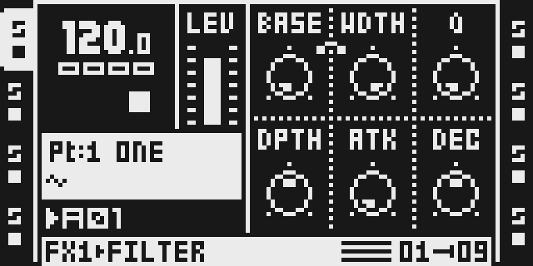
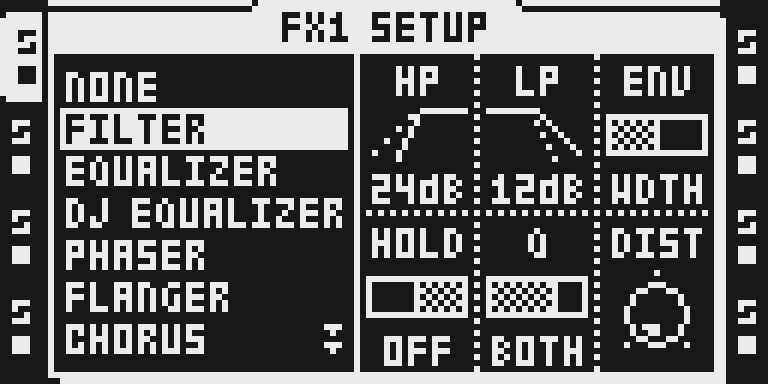

# CC Map

Version: `0.1.2-experimental`. Released with the owner’s 2 October 2026 waiver for these exact source versions. Physical hardware stress and real-chip worst-case cycles are **untested/unmeasured**. The frozen eleven-module baseline is unchanged; later versions require ordinary qualification.

## Overview

CC Map maps incoming MIDI CCs on audio tracks' trig channels to effect page-2 parameters, respecting AUDIO CC IN and clamping values. It writes Part, live and shadow values and marks the Part changed.

Select **CC Map** in Octamod, choose your verified local 1.40C firmware and build/download your configuration. The module applies automatically in the generated firmware. No separate module switch or effect chooser row is needed.

## Controls

| Incoming CC | Target | Limits |
| --- | --- | --- |
| 68–73 | FX1 SETUP slots 6–11, in order | Selected non-NONE effect’s minimum/count; 7-bit input |
| 62–67 | BusDelay/BusVerb FX2 SETUP only | Those effects are outside Octamod’s catalog; this block does not control current FX2 effects |

No effect slot, dedicated knob or module menu is added. FILTER’s setup controls are HP, LP, ENV, HOLD, Q and DIST, in CC order. CC 68 values 0/1 select HP 12/24 dB. Meanings and ranges follow the chosen effect. The handler consumes CC 62–73 even with AUDIO CC IN disabled or without an eligible target. All audio tracks sharing the incoming TRIG CH receive the message. CC 64–67 overlap common pedal messages. Other CCs tail-call stock handling.

## Usage

1. On the MKII panel, press PROJ. Select MIDI with UP/DOWN and press RIGHT to enter its list.
2. Select CONTROL and press YES. Select AUDIO CC IN and turn LEVEL until its checkbox is enabled.
3. Press NO to return to MIDI, select CHANNELS and press YES. Match the target audio track’s TRIG CH to the external controller. The captured T1 uses channel 1; AUTO CH 11 is a different setting.
4. Press NO twice to return to the track. Press T1, then hold FUNC and press FX1 for FX1 SETUP. Turn LEVEL to FILTER and press YES to assign it.
5. FILTER SETUP shows page-2 HP, LP, ENV, HOLD, Q and DIST. Send CC 68 value 1 on channel 1 to change HP from 12 dB to 24 dB.
6. Close SETUP with FX1 and reopen with FUNC+FX1 to refresh the displayed HP value. The cave omits the stock editor’s redraw call.
7. The steps and incoming CC example were verified on the actual MKII emulator LCD. Physical audio, Part save/reload and MKI navigation remain untested.

### Try an FX1 setup parameter

1. Enable AUDIO CC IN in PROJ > MIDI > CONTROL. In MIDI > CHANNELS, set T1’s TRIG CH to 1 and send from the controller on channel 1.
2. Select T1 and FILTER in FUNC+FX1 SETUP. Send CC 68 value 1 on channel 1 to change the first setup parameter, HP, from 12 dB to 24 dB.
3. Close SETUP with FX1 and reopen with FUNC+FX1 to refresh the display. Send CC 68 value 0 to restore 12 dB; disable AUDIO CC IN to stop incoming control.

## Compatibility and limitations

- CC 62–67 write FX2 page 2 only for BusDelay/BusVerb, which are outside scope and not imported. Current catalog/stock FX2 support is not claimed.
- CC 62–73 are consumed even if AUDIO CC IN is disabled or the track's effect has no eligible target.
- CC 64–67 overlap common sustain/portamento/sostenuto/soft-pedal messages.
- Upstream MODE DEFAULTS and SCENES KITS overrides are not imported or enabled.
- Upstream leaves hardware SCENES KITS chaining and FX1-to-DSP updates on THRU tracks open.
- Released with owner approval for software verification only: real hardware stress and chip worst-case timing are untested/unmeasured. The waiver covers this version only.
- Browser builds match native composition for the currently buildable modules, including Repitch, Scale Quantizer and USB Audio/MIDI. MIDI Scenes is a separate pending update; OctaKit remains outside the catalog.

The browser follows the native placement and compatibility rules. Configurations that exhaust space or conflict are refused before download. Source versions are pinned in each build; saved configurations use the current approved versions. The native comparison covers every combination of the nine currently buildable modules and both supported stock-FX2 profiles. It is composition verification, not physical audio qualification.

## Tests and measurements

[TESTING.md](TESTING.md) and [the software report](evidence/software-verification.json) record source/build identities, exact authored allocation, branch/placement rules, native/browser comparisons, rejection checks and limitations. 1,024 selections passed: 522 complete images match byte for byte and 502 refusals agree. Authored source is assembled without stock inputs and relocation is checked at three origins. Real-chip worst-case cycles and physical stress/audio behavior are unmeasured/untested under the exact-version owner waiver.

Ordinary `npm run check` reads source identities, metadata and monochrome PNGs, runs small domain tests, lint/type checks and builds the static application. It never executes firmware, DSP/emulator/hardware workloads. Visitor builds perform compatibility, placement and packaging checks locally.

## Authorship and licences

Sam Banks (@sambanks) authored CC Map. The assembly, byte oracle and upstream notes are unchanged; only the stock-vector expectation was replaced with a lazy local fingerprint guard. Full MIT terms remain in [LICENSE](LICENSE) and the original documentation in [OCTABAM.md](OCTABAM.md).

[Import identities](../../../imports/cc-map-8d0ad6f.json) retain the exact original and vendored file hashes and transformation.

The original illustration is MIT. Actual documentary LCD exports retain Elektron Music Machines attribution and underlying rights; the module’s source licence does not license Elektron firmware or grant ownership of the interface. Contributor declarations and owner review apply; review is not automatic legal clearance. Only authored code, sanitized hashes, documentation and reviewed PNGs are retained. No firmware or extracted routines/tables enter the repository or release automation.

## Screens and audio

These are the visually reviewed, actual monochrome MKII emulator LCD captures from the 0.1.1 capture session, retained for 0.1.2 because assembly/native manifest identities are unchanged. [The capture record](media/capture.json) preserves the original date/version/image, exact panel plan, source hashes and the explicit release binding. No recapture or hardware measurement is claimed. Integer scale 6 preserves real 128×64 pixels. Main/cue screenshots establish shortcuts; they do not measure audio. No audio preview is supplied.

