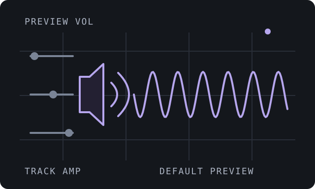
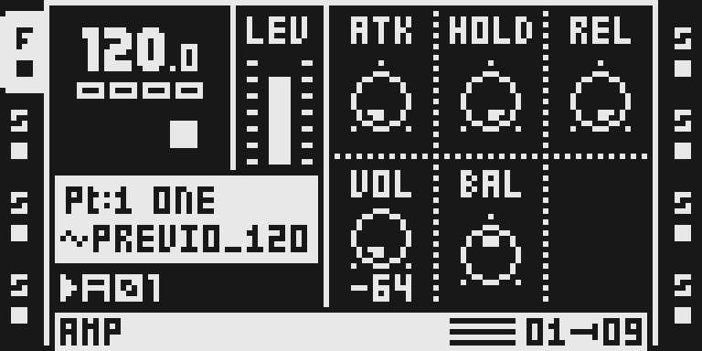
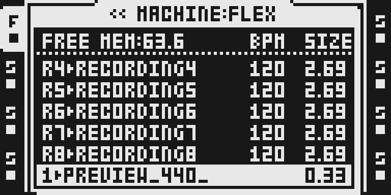
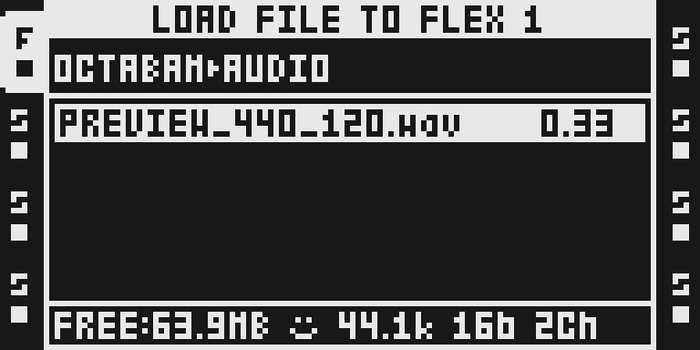
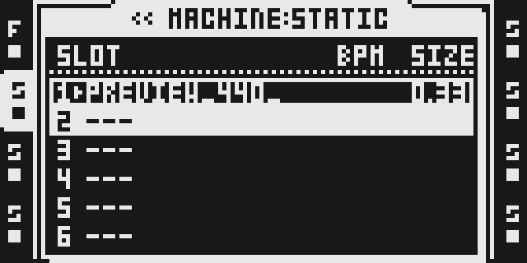

# Preview Vol

Version: `0.1.2-experimental`. Released with the owner’s 2 October 2026 waiver for these exact source versions. Physical hardware stress and real-chip worst-case cycles are **untested/unmeasured**. The frozen eleven-module baseline is unchanged; later versions require ordinary qualification.

## Overview

Preview Vol makes FUNC+YES and CUE+YES sample previews use the default AMP VOL (internal value 64, shown as 0). The active track's AMP volume is restored when the preview stops. Track FX, main/cue levels and mixer volumes still apply, so this is not loudness normalization.

Select **Preview Vol** in Octamod, choose your verified local 1.40C firmware and build/download your configuration. The module applies automatically in the generated firmware. No separate module switch or effect chooser row is needed.

## Controls

| Existing control | Access | Behavior |
| --- | --- | --- |
| Main sample preview | FUNC+YES on the selected sample | Default preview AMP VOL, internal 64 (displayed 0) |
| Cue sample preview | CUE+YES | Same AMP override, existing cue route |
| Track AMP VOL | AMP, encoder D | Ordinary playback keeps the stored volume |
| MAIN/CUE LEVEL, mixer volume | Existing track/mixer controls | Still affect preview output |
| PREVIEW WITHOUT FX | Existing PERSONALIZE setting | Still determines whether track FX apply |

There is no module menu, dedicated knob or effect slot. Including the module applies its two preview hooks automatically. It does not normalize recorded loudness or bypass mixer/track levels. Stop restores ordinary track values through the existing stock path; physical audio/restoration behavior remains untested.

## Usage

1. Include Preview Vol in your Octamod build. It applies automatically to sample auditioning and uses no effect slot.
2. Select a Flex or Static audio track and double-tap its TRACK key to open the sample slot list. Use UP/DOWN or LEVEL to select a sample.
3. Hold FUNC and press YES for a main-output preview, or hold CUE and press YES for a cue-output preview. Press NO to stop/leave preview access.
4. From the sample list, press YES to open LOAD FILE TO FLEX/STATIC. Select a file with UP/DOWN or LEVEL; the same preview shortcuts apply in the file browser.
5. With a loaded sample on the active track, press AED on MKII to open the audio editor. Use the same preview shortcuts. The corresponding MKI editor route still requires panel verification.
6. Press AMP to view ATK, HOLD, REL, VOL and BAL. Encoder D changes the track AMP VOL. Preview Vol overrides only preview AMP VOL; track FX, MAIN/CUE LEVEL and mixer volumes remain effective.

### Quick tutorial

1. Select a Flex or Static audio track, load a sample and double-tap its TRACK key to open the slot list.
2. Press AMP and turn encoder D to reduce the track AMP VOL; return to the sample list and hold FUNC while pressing YES to preview through main. Use CUE+YES to audition through cue.
3. Press NO to stop/leave preview access. Verify normal track playback uses the stored AMP VOL; compare both Flex and Static, then repeat from the file browser and MKII audio editor.

## Compatibility and limitations

- This changes preview AMP VOL only; it does not normalize sample loudness or bypass track FX, track levels or mixer settings.
- No effect slot or dedicated module knob; the automatic USB no-UI exception does not apply.
- Actual MKII emulator captures show loaded Flex/Static access, file browser, editor and AMP pages. Audio behavior, MKI navigation, hardware timing and restoration after interruption remain unqualified.
- Released with owner approval for software verification only: real hardware stress and chip worst-case timing are untested/unmeasured. The waiver covers this version only.
- Browser builds match native composition for the currently buildable modules, including Repitch, Scale Quantizer and USB Audio/MIDI. MIDI Scenes is a separate pending update; OctaKit remains outside the catalog.

The browser follows the native placement and compatibility rules. Configurations that exhaust space or conflict are refused before download. Source versions are pinned in each build; saved configurations use the current approved versions. The native comparison covers every combination of the nine currently buildable modules and both supported stock-FX2 profiles. It is composition verification, not physical audio qualification.

## Tests and measurements

[TESTING.md](TESTING.md) and [the software report](evidence/software-verification.json) record source/build identities, exact authored allocation, branch/placement rules, native/browser comparisons, rejection checks and limitations. 1,024 selections passed: 522 complete images match byte for byte and 502 refusals agree. Authored source is assembled without stock inputs and relocation is checked at three origins. Real-chip worst-case cycles and physical stress/audio behavior are unmeasured/untested under the exact-version owner waiver.

Ordinary `npm run check` reads source identities, metadata and monochrome PNGs, runs small domain tests, lint/type checks and builds the static application. It never executes firmware, DSP/emulator/hardware workloads. Visitor builds perform compatibility, placement and packaging checks locally.

## Authorship and licences

The source is pinned to repeat98/octamad commit `906fc354536d9a1d6ccd90a87fcf3c1f6edb6488`. The native declaration has no separate per-module author field; credit remains with the pinned octamad snapshot and retained Sam Banks MIT copyright. [LICENSE](LICENSE) preserves the full terms, [OCTAMAD.md](OCTAMAD.md) the original documentation and [import identities](../../../imports/previewvol-906fc354.json) the original/vendored hashes. Assembly is unchanged; the two stock expectations become lazy local fingerprint guards.

The original illustration is MIT. Actual documentary LCD exports retain Elektron Music Machines attribution and underlying rights; the module’s source licence does not license Elektron firmware or grant ownership of the interface. Contributor declarations and owner review apply; review is not automatic legal clearance. Only authored code, sanitized hashes, documentation and reviewed PNGs are retained. No firmware or extracted routines/tables enter the repository or release automation.

## Screens and audio

These are the visually reviewed, actual monochrome MKII emulator LCD captures from the 0.1.1 capture session, retained for 0.1.2 because assembly/native manifest identities are unchanged. [The capture record](media/capture.json) preserves the original date/version/image, exact panel plan, source hashes and the explicit release binding. No recapture or hardware measurement is claimed. Integer scale 6 preserves real 128×64 pixels. Main/cue screenshots establish shortcuts; they do not measure audio. No audio preview is supplied.

