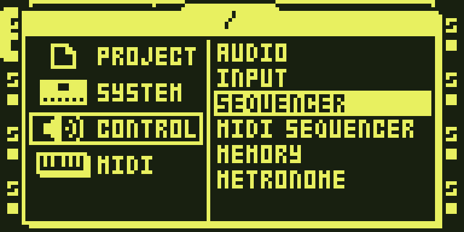
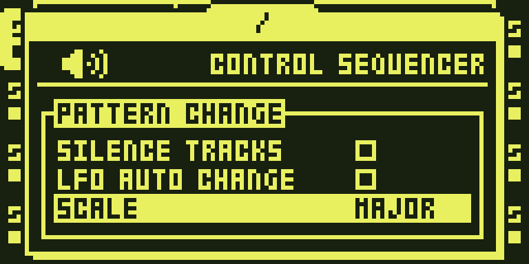
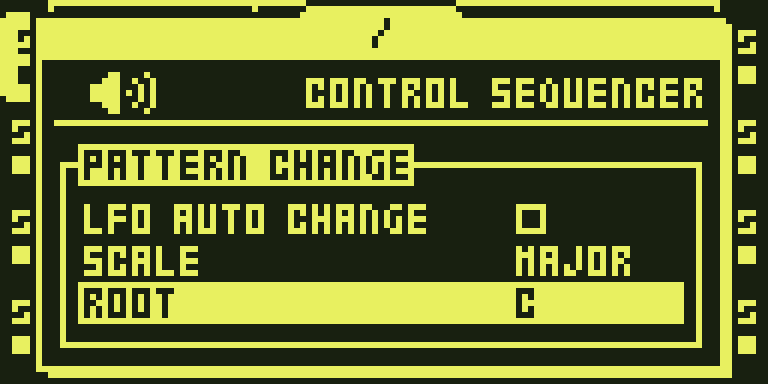
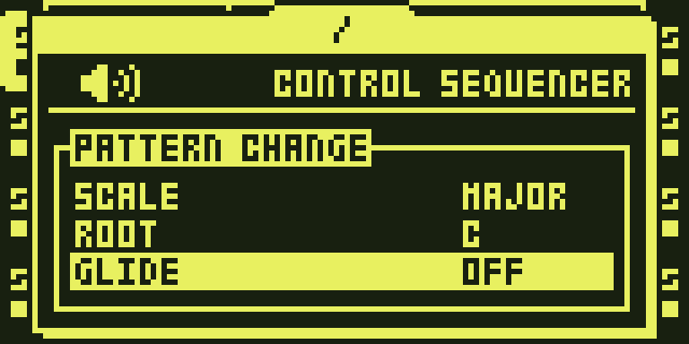

# `quantizer` — SCALE QUANTIZER

The PTCH knob and the chromatic trig keys snap to a scale built on a root,
and the synth gets a glide time: a SCALE row, a ROOT row and a GLIDE row in
PROJECT > CONTROL > SEQUENCER, built from
[timhastie/octatrick-modules](https://github.com/timhastie/octatrick-modules)
(submodule `upstream/`, pinned to `v2.9` (`525f4b1`)). `Kind.CF_PATCH`: one
DRAM unit (`quantizer.s`), a 192-byte ROM core (`core.s`) and two pinned
ROM stubs (`keys.s`, `scale.s`), detours, pokes and a `TableGrow` for the
menu rows. No DSP code, no FX2 row.

SCALE (OFF, then 24 scales): the PTCH knob on the PLAYBACK page of a
STATIC / FLEX / PICKUP track steps to the next scale degree, on the Part's
value and on a step's lock; a [TRIG] key in CHROMATIC trig mode snaps to the
nearest degree before it becomes the pitch the voice, the recorded lock and
the screen see. ROOT (C .. B, since 2.9, the row under SCALE): the scale is
built on the root -- the knob, the locks, the keys and the synth's chord
snap all read one root-rotated mask -- key 1 of the CHROMATIC keyboard
sounds the root (the number beside the keyboard reads the root's name, "A
0"), and a sample track's keyboard plays the one complete root-to-root
octave the stock range holds (the other keyboard position is the partial
octave on the side that clamps fewer keys). ROOT C is 2.8's behaviour byte
for byte; SCALE OFF ignores ROOT. GLIDE (OFF, 1..127): the slide time of
the synth's and a sample track's legato (the LEG box on every audio track's
AMP SETUP page is the legato switch: OFF / MONO on a sample track, OFF /
MONO / POLY on a synth track); polyphonic chromatic keys on a synth track
whose VOIC is 2..4. Live recording on a synth track writes the played note
length as an AMP HOLD lock and hands every recorded key to the synth
engine, which records fingered chords. SCALE, GLIDE and ROOT are
battery-RAM bytes (`0x100b14ec` / `0x100b14ed` / `0x100b14ee`), so they
survive a power cycle like the stock project settings; ROOT is saved as
`#SEQUENCER_ROOT` after the SCALE line. `upstream/quantizer/README.md` is
the full description, with what was measured and what was inferred.

## Measured

- At `v9.1`, remixes `octatrick` and `octatrick-usb` built byte-identical
  with the module sources as a plain `modules/<name>/` directory and as this
  wrapper over the submodule (same base, same build reports), and
  byte-identical to the OCTATRICK9 images Tim flashed (built on
  upstream `0e93543`; upstream's changes since touch modules these
  remixes do not carry).
- In the ColdFire port through the virtual panel, per feature
  (`upstream/quantizer/README.md` "Measured" and "ROOT, and the move into
  DRAM"): the knob and the keys under each scale, ROOT on synth and sample
  tracks (both keyboard positions, the readout), SCALE OFF stock, the SAVE
  lines and the warm boot of the three bytes.

## On the unit

- 26 Sep 2026: `OCTATRICK9` (remix `octatrick-usb`) on Tim's Octatrack MKI.
- Every test build since, 2.3 .. 2.8, flashed on the same MKI from Tim's
  own tree ([timhastie/octatrick](https://github.com/timhastie/octatrick),
  the same wrappers over the same submodule), and the 2.9 line up to the
  build before its last two fixes (ROOT and the DRAM unit included). The
  last two 2.9 fixes (the synth's sequencer trigs and index ramp) are
  emulator-verified on `octatrick` (`make check` on this tree).

## How it is built

Source: `upstream/` is Tim's repository (submodule, pinned to `v2.9`
(`525f4b1`)). Nothing inside `upstream/` is edited here. The manifest here
(`manifest.py`) executes `upstream/quantizer/manifest.py` from the source on
disk and re-exports its `MODULE`; that manifest derives its source paths
from its own directory, so the same file builds at `modules/quantizer/` in
Tim's tree and at `modules/quantizer/upstream/quantizer/` here. Since 2.9
the quantizer is a DRAM unit of the platform runtime (`quantizer.s`,
`Linked(dram=True)`, linked with the synth's engine and depacked at boot
into the arena reserve, `docs/contributing/PLACEMENT.md`); the OS image keeps
`core.s` (192 B: the boot clamps, the defaults and the root-rotated scale
mask, in ROM so the pinned trampoline can name it at link time and so the
three bytes are sane whether or not a runtime was depacked) and the two
pinned stubs, the key trampoline and the scale trampoline (`KEYS_AT`,
`SCALE_AT`), that SYNTH MACHINE's engine reads. The boot order was checked
under the port: the loader runs from the boot redirect before `.data` and
`main`, and both detour sites of the DRAM unit run from `main`. The SCALE,
GLIDE and ROOT bytes are battery-backed RAM (`GLIDE_AT` and its
neighbours), clamped by two `jsr` detours where stock sanitises its own
settings block. The ROM footprint went from 3,319 B at 2.8 (3,268 + 45 + 6)
to 243 B (192 + 45 + 6), so the zero run holds DIRECT JUMP's cave beside
CF METER's descriptor clone again.

## Updating

Bump the submodule pin and rebuild; SYNTH MACHINE reads the pinned
addresses, so a pin that moves them needs both modules bumped together.

## Octamod import — 1 October 2026

Module version: `0.1.1-experimental`. Imported from [sambanks/octabam at `363861e31ee9`](https://github.com/sambanks/octabam/tree/363861e31ee963c478fab2b190a0fabe1d7ce37b/modules/quantizer). The author implementation is pinned to `525f4b19b04dc3ba3f3bae3b25abbf48df34a10a` (v2.9); only the quantizer sources and author documentation/licence are vendored as ordinary files. Stock expectation bytes in manifests are converted to address/length/SHA-256 guards; they resolve only from the user’s own verified local OS. See [TESTING.md](TESTING.md) for composition verification and historical evidence. Native and actual-browser composition, packaging and rejection verification passed; no DSP execution or emulator suite was run. Owner merge of a reviewed PR remains required for publication.

Octamod 0.1.1-experimental: browser composition uses reviewed source packages and derives inherited bytes from local 1.40C. The native matrix passed 156 byte identities and 132 refusals. The owner reported both combined native test images working on 1 October 2026; detailed feature/load qualification is not claimed.

## Access and actual OT UI captures

PROJECT > CONTROL > SEQUENCER: SCALE, ROOT and GLIDE rows.

1. On the MKII panel, press PROJ to open the project menu.
2. Use UP/DOWN to select CONTROL, then press RIGHT to enter its list.
3. Select SEQUENCER with UP/DOWN and press YES.
4. Scroll DOWN to SCALE and turn LEVEL to choose a scale. OFF restores stock pitch behavior.
5. Scroll to ROOT and turn LEVEL to select the key. GLIDE is the next row; its effect depends on the track’s LEG setting.

These are actual firmware-rendered emulator LCD captures. See [TESTING.md](TESTING.md),
[capture provenance](media/capture.json) and [media rights](media/LICENSE.md).
