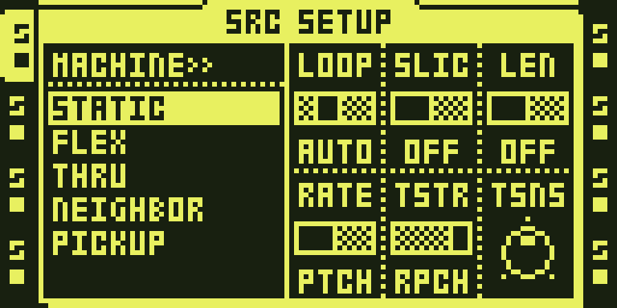
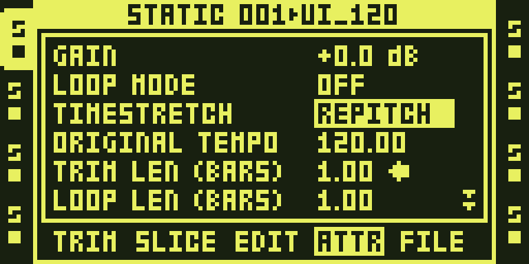
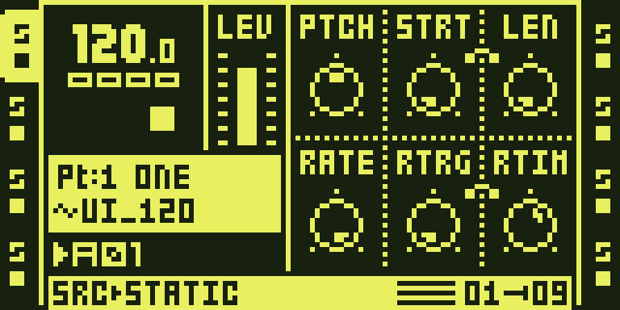

# Repitch

Version: 0.1.1-experimental · author: [Jannik Aßfalg](https://github.com/repeat98)

Adds a fifth timestretch value, REPITCH: the track follows the project
tempo by playback speed instead of grains (`speed = project BPM / sample
BPM`), live, like a turntable. A 120 BPM loop plays untouched at 120 BPM
and a fourth lower, 4/3 as long, at 90 BPM. To the voice renderer the
track is on OFF (dry); only its playback increment carries the tempo.

- **SRC SETUP** (STATIC, FLEX): `TSTR` gains `RPCH` after OFF, AUTO, NORM,
  BEAT.
- **Audio editor, ATTR**: the sample's `TIMESTRETCH` gains `REPITCH` after
  BEAT; it applies when the track's TSTR is `AUTO`.
- **PTCH is off** on a REPITCH track: not applied, and its knob on the SRC
  page draws empty. RATE still applies.
- The speed is clamped to 2x; a sample without a tempo in 30..300 BPM plays
  as stock. PICKUP is not offered REPITCH.

Existing values keep their raw numbers (OFF=0, AUTO=1, NORM=2, BEAT=3), so
saved projects load unchanged. A project saved with REPITCH stores 4, which
a stock OS does not know.

Status: working on an MKII (image OCTABAM81, 16 Sep 2026), and measured
under the ColdFire port and the Python emulator (`docs/firmware/REPITCH.md`,
`python3 tools/verify/verify_repitch.py`). The MKI runs the same OS image
and the module binds no keys, so the same build serves it; not yet run on
an MKI. Image 80 drew the panel right but kept the sample's tempo and
sounded stretched: the renderer still moved the sample by output samples
(`docs/firmware/REPITCH.md`, fixed since).

## Open

- Slices and the recorder buffers are not measured.

## Access on the OT and actual UI captures

STATIC or FLEX track SRC SETUP: TSTR = RPCH. The sample attribute route also offers TIMESTRETCH = REPITCH.

1. Select a STATIC or FLEX audio track with its TRACK key. PICKUP does not offer REPITCH.
2. Hold FUNC and press SRC to open SRC SETUP.
3. Turn encoder E (TSTR) to RPCH, after OFF, AUTO, NORM and BEAT.
4. Press SRC to close SETUP. REPITCH disables PTCH; RATE still applies.
5. For the sample-based route, load and select a sample on the STATIC or FLEX track. Press AED on the MKII panel, then FX1 to open the audio editor ATTR page.
6. Use UP/DOWN to select TIMESTRETCH. Press RIGHT to step through NORMAL, BEAT and REPITCH; LEFT steps back. Return to the track and set TSTR to AUTO in FUNC + SRC SETUP to use that sample attribute.

These are actual headless-emulator LCD captures, not hardware results. See
[TESTING.md](TESTING.md), [capture provenance](media/capture.json) and
[media rights](media/LICENSE.md).
